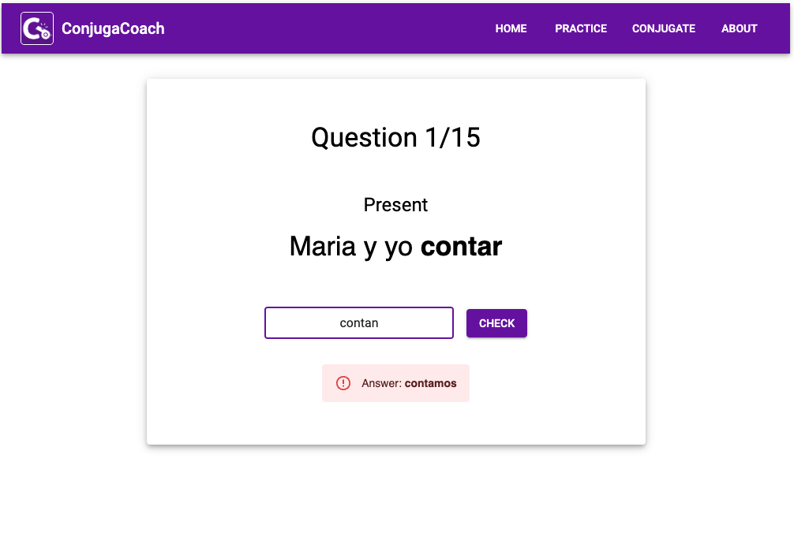

# ConjugaCoach

ConjugaCoach is a full-stack web application designed to help users master Spanish verb 
conjugations through personalized practice quizzes.

## Screenshots

## Features

- **Customizable Quizzes:** Users can tailor their practice by selecting specific verbs, pronouns, 
and tenses.
- **Verb Selection:** An intuitive autofill dropdown menu allows users to select from a curated list of 200 
commonly used regular and irregular Spanish verbs.
- **Immediate Feedback:** Feedback is instantly provided, requiring users to type the correct
answer before moving to the next question, which aids in memory retention.
- **Conjugation Tables**: The Conjugate page allows 
users to quickly select a verb and see all of its conjugated forms in neatly organized tables.

## Technologies
- **Frontend:** React, Material UI, JavaScript
- **Backend:** Python, Flask
- **Database:** SQLite
- **Testing:** Python's unittest framework
